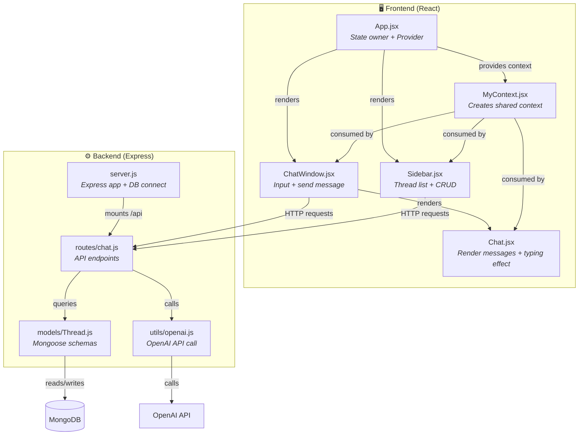
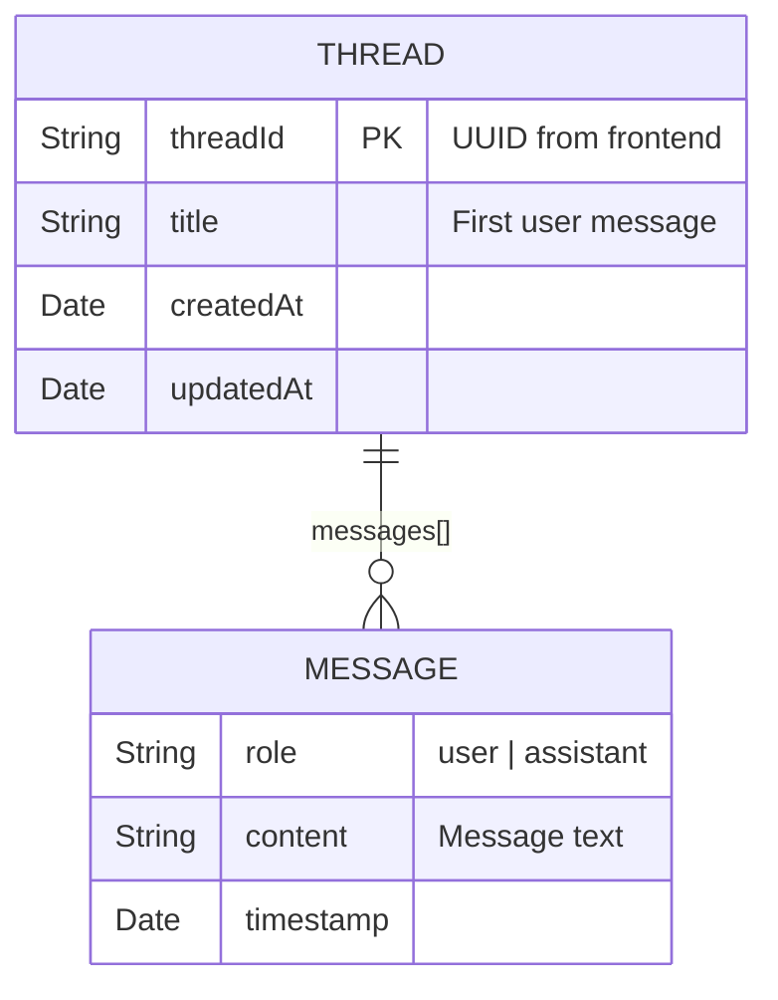
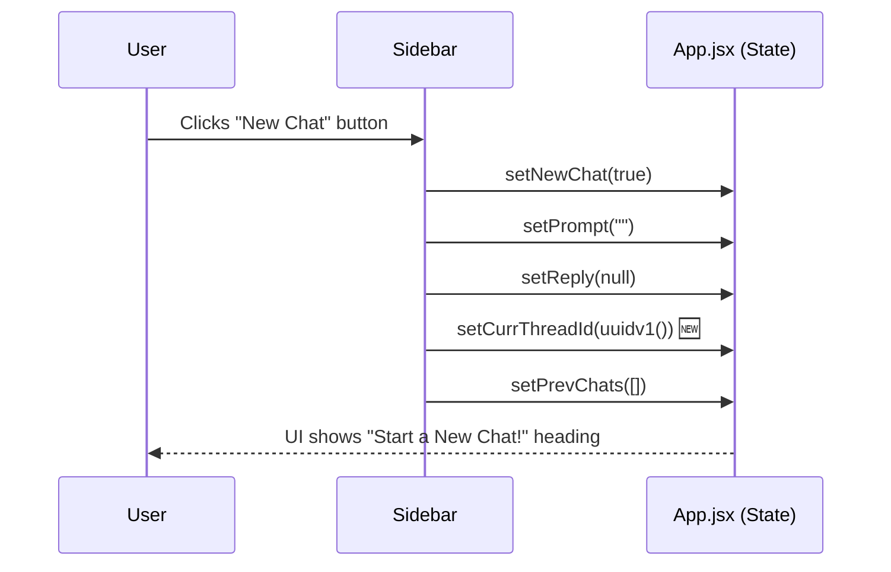
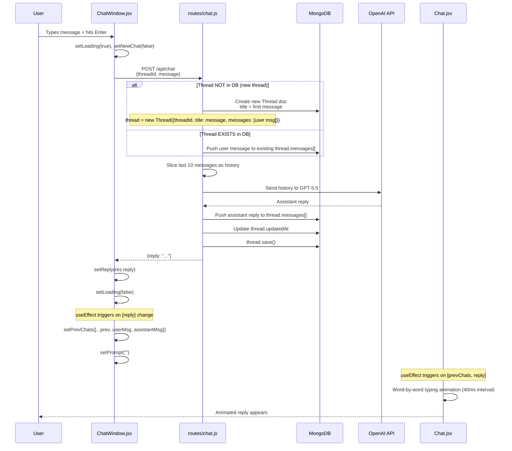
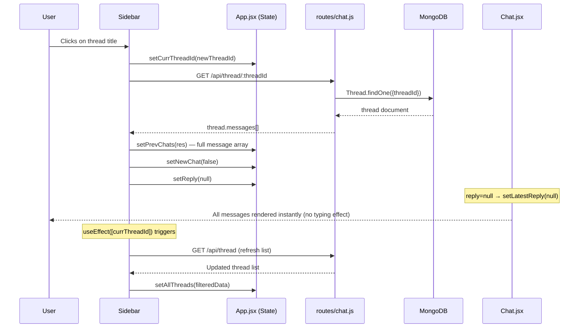
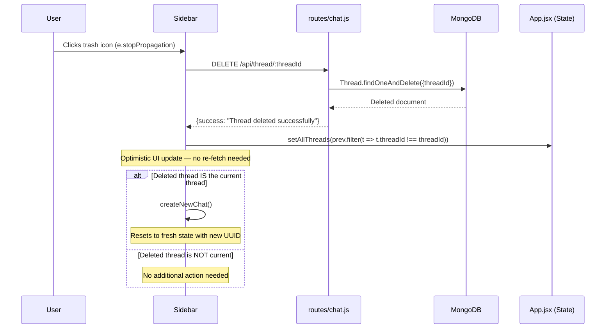
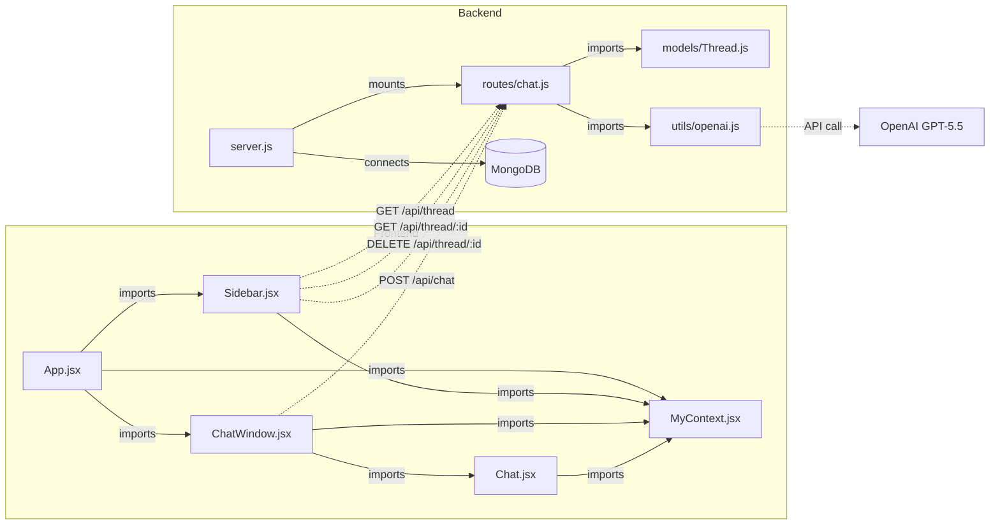

# 🧵 SigmaGPT — Thread Workflow Diagram

## Architecture Overview

---

## Shared State (via Context)

All thread-related state lives in [App.jsx](file:///f:/Major%20Projects/SigmaGPT/Frontend/src/App.jsx) and is shared through [MyContext.jsx](file:///f:/Major%20Projects/SigmaGPT/Frontend/src/MyContext.jsx):

| State Variable | Type | Purpose |
|---|---|---|
| `currThreadId` | `string` | UUID of the currently active thread |
| `allThreads` | `[{threadId, title}]` | List of all threads shown in sidebar |
| `prevChats` | `[{role, content}]` | All messages of the current thread |
| `prompt` | `string` | Current user input text |
| `reply` | `string \| null` | Latest assistant reply (triggers typing animation) |
| `newChat` | `boolean` | Whether the UI is in "new chat" mode |

---

## Data Model (MongoDB)

Defined in [Thread.js](file:///f:/Major%20Projects/SigmaGPT/Backend/models/Thread.js):

---

## 4 Thread Operations — Step-by-Step Flows

### 1️⃣ Create New Chat (no backend call)

> Triggered when user clicks the **✏️ New Chat** button in the sidebar.

**What happens:**
- A brand-new UUID is generated client-side (`uuidv1()`)
- All chat state is cleared — no backend call yet
- The thread is **NOT saved to the database** until the user actually sends a message
- [Sidebar.jsx](file:///f:/Major%20Projects/SigmaGPT/Frontend/src/Sidebar.jsx#L26-L32) → `createNewChat()`

---

### 2️⃣ Send Message (Creates Thread or Appends to Existing)

> Triggered when user types a message and hits **Enter** or clicks **Send**.

**Key decision point — New vs Existing thread:**

| Condition | What Happens | File |
|---|---|---|
| `Thread.findOne({threadId})` returns `null` | **New Thread created** in DB with `title = first message` | [routes/chat.js:L80-L86](file:///f:/Major%20Projects/SigmaGPT/Backend/routes/chat.js#L80-L86) |
| Thread already exists | User message **pushed** to existing `messages[]` array | [routes/chat.js:L87-L89](file:///f:/Major%20Projects/SigmaGPT/Backend/routes/chat.js#L87-L89) |

**After the reply returns:**
- [ChatWindow.jsx](file:///f:/Major%20Projects/SigmaGPT/Frontend/src/ChatWindow.jsx#L40-L54) `useEffect([reply])` appends both user + assistant messages to `prevChats`
- [Chat.jsx](file:///f:/Major%20Projects/SigmaGPT/Frontend/src/Chat.jsx#L12-L32) `useEffect([prevChats, reply])` animates the latest reply word-by-word

---

### 3️⃣ Switch Thread (Load Existing Chat)

> Triggered when user clicks on a thread title in the sidebar.

**Why `setReply(null)` matters:**
- Setting reply to `null` makes `Chat.jsx` set `latestReply = null`
- This skips the typing animation and renders the **last message instantly** via the `non-typing` branch
- [Chat.jsx:L55-L58](file:///f:/Major%20Projects/SigmaGPT/Frontend/src/Chat.jsx#L55-L58) — renders `prevChats[last].content` directly

---

### 4️⃣ Delete Thread

> Triggered when user clicks the **🗑️ trash** icon on a thread.

**Important detail:** `e.stopPropagation()` prevents the click from bubbling up to the `<li>` which would trigger `changeThread()`.

---

## Complete File Connection Map

---

## API Endpoints Summary

| Method | Endpoint | Triggered By | Purpose |
|---|---|---|---|
| `GET` | `/api/thread` | `Sidebar.jsx` on mount + when `currThreadId` changes | Fetch all threads (sorted by `updatedAt` desc) |
| `GET` | `/api/thread/:threadId` | `Sidebar.jsx` → `changeThread()` | Fetch messages of a specific thread |
| `POST` | `/api/chat` | `ChatWindow.jsx` → `getReply()` | Send message, get AI reply (creates or updates thread) |
| `DELETE` | `/api/thread/:threadId` | `Sidebar.jsx` → `deleteThread()` | Delete a thread from DB |

---

## TL;DR — How Threads Work

1. **Threads are lazy-created** — a new UUID is generated on the frontend when you click "New Chat", but the thread only appears in the database when you send the first message.
2. **The backend decides** whether to create or update — `POST /api/chat` checks if the `threadId` already exists in MongoDB. If not → new thread. If yes → append message.
3. **The sidebar refreshes** every time `currThreadId` changes (via `useEffect`), keeping the thread list up-to-date.
4. **The typing animation** only plays for new replies (`reply !== null`). When switching threads, `reply` is set to `null`, so old messages render instantly.
